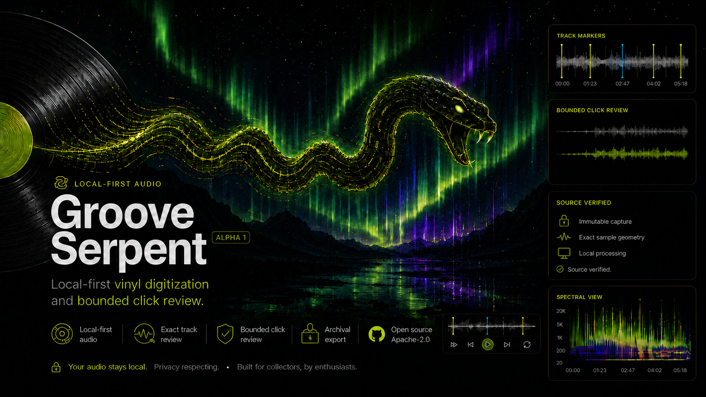
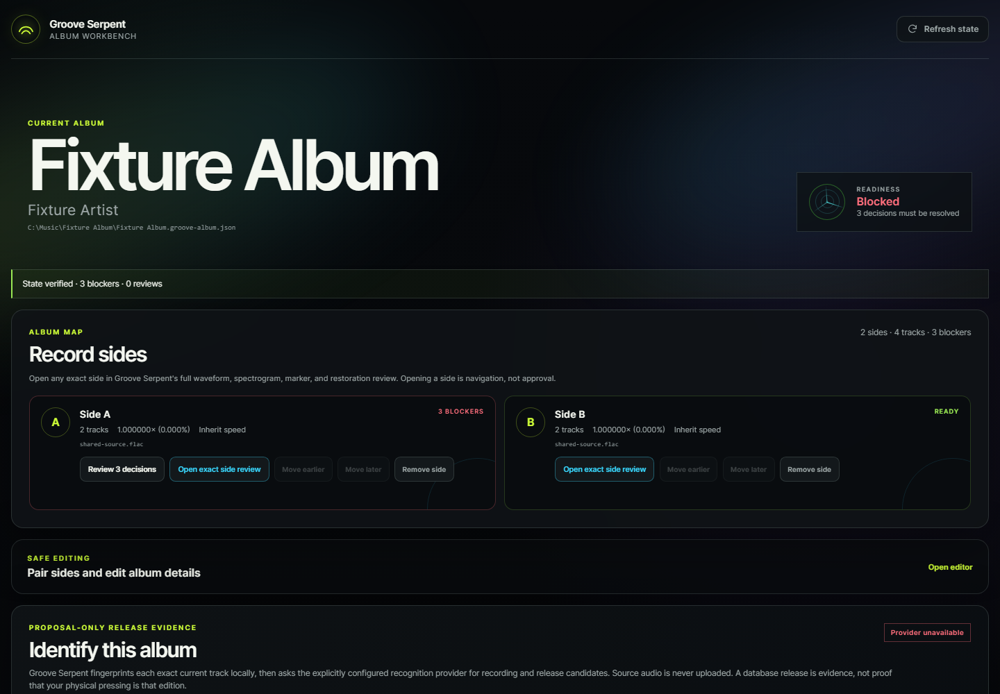

# Groove Serpent



Groove Serpent is an experimental, local-first workbench for digitizing and conservatively restoring vinyl records.

The normal workflow is:

1. Record one vinyl side and export it as FLAC.
2. Analyze it with Groove Serpent.
3. Review the proposed track boundaries.
4. Select or enter release metadata.
5. Audition conservative restoration proposals.
6. Export archival FLAC and portable AAC/M4A derivatives.

The preservation contract is deliberately simple:

- The source capture is never modified.
- Automatic decisions require review.
- Restoration is conservative and rendered as a separate derivative.
- No account, telemetry, or cloud audio upload is required.

Groove Serpent is collector-grade software: cautious with irreplaceable captures, transparent about uncertainty, and designed for repeated local use. It does not try to turn a record into a modern studio master. Your ears remain the final authority.

## Current status

This repository is pre-release software. Track splitting, metadata review, fixed speed correction, click-restoration review, side/album publication, and exact receipts are under active development. Review every proposed boundary and restoration event before export.

Current restoration targets isolated clicks and short clipped impulses. Broadband hiss, hum, rumble, continuous crackle, wow, flutter, and time-varying speed correction are not yet implemented.

The evidence analyzer limits decoded float32 input to 256 MiB. That is an input bound, not a guarantee about total process memory.

## Requirements

- Python 3.11, 3.12, or 3.13
- [FFmpeg](https://ffmpeg.org/) and `ffprobe` on `PATH`. Speed correction
  requires an FFmpeg build with libsoxr enabled.
- A browser for the review workbench
- Optional: Chromaprint's `fpcalc` for AcoustID fingerprint lookup

On Windows, Chocolatey's full build provides the required resampler:

```console
choco install ffmpeg-full --version=8.1.2
```

## Install from a checkout

```console
git clone https://github.com/BluntforceRiot/groove-serpent
cd groove-serpent
python -m pip install .
groove-serpent doctor
```

For an isolated developer environment, install [uv](https://docs.astral.sh/uv/) and run:

```console
uv sync --frozen --group dev
uv run groove-serpent doctor
```

## Try it with synthetic audio

The demo generator creates project-owned synthetic tones and noise; it does not require a copyrighted recording.

```console
uv run python scripts/create_demo_audio.py --output-dir demo
uv run groove-serpent analyze "demo/Groove Serpent Demo - Side A.flac" --tracklist demo/demo-tracklist.json --project demo/demo.groove.json --min-track 2
uv run groove-serpent review demo/demo.groove.json
```

The review page lets you inspect waveform and spectrogram evidence, zoom around a boundary, audition transitions, edit markers and metadata, and review restoration proposals. Album-side pairing is currently a CLI workflow.



## Privacy and network behavior

Analysis, review, restoration, and export are local. Network access occurs only when you explicitly request an optional provider operation:

- MusicBrainz metadata search
- Cover Art Archive artwork lookup
- AcoustID fingerprint lookup

AcoustID receives a fingerprint and duration, not the source recording. Review provider metadata and artwork before publication.

## Contributing and security

Read [CONTRIBUTING.md](CONTRIBUTING.md) before opening an issue or pull request. Never upload copyrighted recordings or artwork, API keys, or private project files. Report vulnerabilities privately as described in [SECURITY.md](SECURITY.md).

Third-party components and services are described in [THIRD_PARTY_NOTICES.md](THIRD_PARTY_NOTICES.md). Groove Serpent is licensed under the [Apache License 2.0](LICENSE).

See [CHANGELOG.md](CHANGELOG.md) for public release notes.
