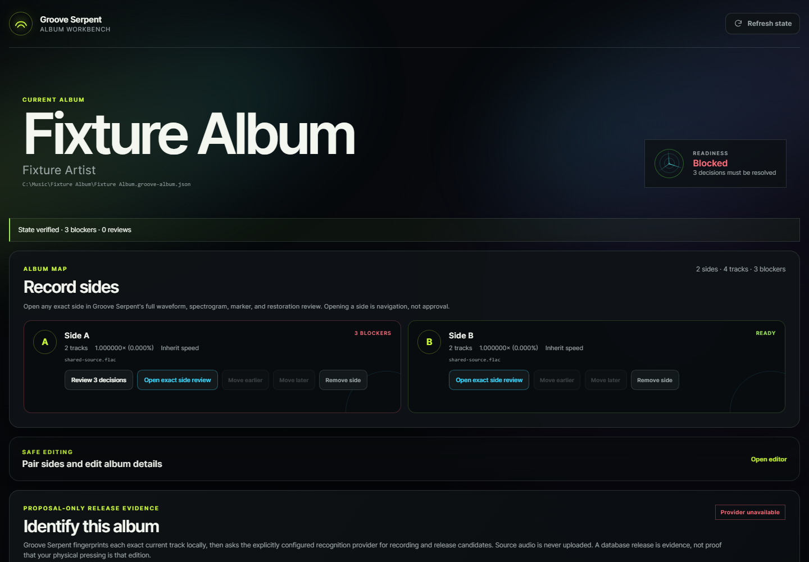

# Groove Serpent


Groove Serpent is a local-first, open-source workbench for turning completed vinyl captures into
reviewed, reproducible digital albums.

It proposes exact track boundaries, identifies or accepts release metadata and artwork, pairs record
sides, offers conservative restoration audition, and publishes verified FLAC and AAC/M4A copies.
The original capture is never modified. Automatic work remains reviewable, reversible, and bound to
the exact bytes that were inspected. **Your ears are the final authority.**

## Why it is different

- **Local first:** no account, telemetry, subscription, or source-audio upload.
- **Exact review:** audio, waveform, spectrogram, markers, selection, and playhead share integer
  source-sample coordinates.
- **Album aware:** pair sides, expose drift and unresolved work, open exact side evidence, and publish
  through one Album Workbench.
- **Conservative restoration:** compare Original, Proposed, and Removed Signal before accepting any
  bounded change.
- **Reproducible:** strict project files, hashes, history, migrations, immutable publication plans,
  complete verification, replay, and recovery receipts.
- **Agent safe:** an optional Codex/Hermes skill uses strict propose/apply separation and cannot grant
  itself listening or publication approval.



## 1.1 release status

This tree is being prepared as **Groove Serpent 1.1.0** for release; it is not yet published.
1.1 focuses on source fidelity, trustworthy restoration review, safer recovery, and release
integrity. A reviewed development candidate is not proof of changed stable-release bytes: consult
the exact version and artifact hashes in the release's build-cycle receipt before relying on a
validation claim. See [1.1 release notes](RELEASE_NOTES_1.1.md) and [CHANGELOG.md](CHANGELOG.md).

## What's new in 1.1

- **Full-precision archival checks:** independently probe source bytes and refuse saved descriptors
  with mismatched bit depth, channels, sample rate, codec, sample format, or frame count. Original
  audition uses the same source-authority checks. Archival FLAC verification retains low-order
  24-bit information instead of comparing at a precision selected by the output.
- **Playback-backed click approval:** the owner browser must play Original, Proposed, and Removed
  Signal continuously at normal speed through the changed window. Seeking, pausing, stalling, or
  changing speed does not count as a completed audition. This records a browser action, not proof
  that a person heard or approved the sound.
- **Review that survives reopening:** rejected and protected click decisions are saved against the
  exact project, source, scan, candidate, and preview. Pending approvals still require fresh
  audition; a partial decision journal never authorizes a render.
- **Independent music endpoints:** an uncertain intro no longer suppresses a useful ending
  proposal, or vice versa. Shared-capture side reviews are invalidated when neighboring-side
  changes make their scope stale. Every proposed edge still needs owner review.
- **Safer failure handling:** cleanup checks the original writer and staging ownership, preserves
  substituted files/directories, and retains uncertain artifacts. Track renders refuse existing
  staging outputs and encoder error diagnostics, including zero-exit no-overwrite refusals.
  Stricter JSON, request handling,
  Windows leases, output-path checks, and portable relative paths close additional failure cases.
- **Clearer release integrity:** ordinary changes can produce deterministic candidate source
  archives without borrowing a prior release's authority. Public source archives exclude Git
  history bundles and are checked for private data as well as package contents.

## The complete workbench

- Exact side analysis and marker editing, including split/merge, zoom, audition, undo/redo, history,
  and checkpoints.
- Multi-side `groove-serpent.album/3` projects and an exception-first browser Album Workbench.
- Optional MusicBrainz, Cover Art Archive, and AcoustID evidence; manual metadata and artwork remain
  first-class.
- Review-only multimodal endpoint and constant-speed proposals with confidence and abstention.
- Exact derivative fixed-speed rendering through integer `asetrate` and libsoxr; pitch and tempo move
  together and archival output stays separate.
- Bounded click/pop/clipped-run repair plus persistent hum, rumble, hiss, and crackle audition
  workflows.
- Unified archival-source, reviewed-restored, corrected-lossless, and portable publication profiles.
- Full output decode verification, exact chapters, approximate CUE, close/reopen discovery,
  deterministic replay comparison, and receipted orphan recovery.
- Explicit project/album migrations and an optional disabled-by-default private evidence corpus.

## Install

The source package accepts Python 3.11, 3.12, or 3.13 and requires FFmpeg and ffprobe on `PATH`.
NumPy installs with the package. Fixed-speed correction additionally needs FFmpeg's libsoxr support;
`doctor` reports the available tools and capabilities.

The reviewed 1.1 development evidence covers native Windows with Python 3.11 and 3.13. Native
Linux/WSL/macOS and Python 3.12 were not rerun for that candidate. The commands below describe
installation, not a claim of fresh stable-release certification on every platform.

Windows PowerShell:

```powershell
python -m venv .venv
.venv\Scripts\python -m pip install .
.venv\Scripts\groove-serpent doctor
```

Linux or macOS:

```bash
python3 -m venv .venv
.venv/bin/python -m pip install .
.venv/bin/groove-serpent doctor
```

For a source checkout with `uv`:

```console
uv sync --frozen --group dev
uv run --frozen groove-serpent doctor --json
```

Supported lossless capture formats and workload limits are documented in
[`SUPPORTED_CAPTURES.md`](SUPPORTED_CAPTURES.md). Start with one FLAC per side when possible;
bounded click restoration currently requires 16-bit or 24-bit integer FLAC.

A Windows portable builder is included, but this 1.1 handoff contains source and Python packages,
not a newly certified Windows portable. Only a separately listed, hash-bound release asset
establishes a portable's availability. Treat
portable builds as unsigned unless their exact receipt proves otherwise; the historical 1.0
portable receipt does not validate 1.1. See [Windows delivery policy](WINDOWS_RELEASE_POLICY.md).

## A complete album loop

Run these commands from the album's working folder, keeping its side projects, captures, and
artwork within that folder. Replace the example names and track counts with your record's.
Commands use `groove-serpent` as shorthand: from an unactivated virtual environment, use the full
path to your installation's `.venv\Scripts\groove-serpent` on Windows or
`.venv/bin/groove-serpent` on Linux/macOS.

Analyze each side into a new project:

```powershell
groove-serpent analyze "Artist - Album - Side A.flac" --tracks 5 --side A
groove-serpent analyze "Artist - Album - Side B.flac" --tracks 5 --side B
```

Pair and review:

```powershell
groove-serpent album create "Artist - Album.album.json" `
  --side "A|Artist - Album - Side A.groove.json" `
  --side "B|Artist - Album - Side B.groove.json" `
  --artist "Artist" --album "Album"

groove-serpent album review "Artist - Album.album.json"
```

In the workbench, review track boundaries and music endpoints, enter or explicitly look up
metadata/artwork, and audition any optional speed or restoration proposal. If a side changes,
review the drift and explicitly repin that side; repinning is approval, not an automatic refresh.

Inspect readiness, then plan and publish only after the owner has reviewed the exact work:

```powershell
groove-serpent album inspect "Artist - Album.album.json" --json

groove-serpent album publication plan "Artist - Album.album.json" `
  "Artist - Album.publication-plan.json" `
  --profiles archival-source,corrected-lossless,portable --restoration none

groove-serpent album publication preflight "Artist - Album.publication-plan.json" --json
groove-serpent album publication execute "Artist - Album.publication-plan.json" `
  "exports\Artist - Album"
groove-serpent album publication verify "exports\Artist - Album" --json
```

This example deliberately applies no restoration. `archival-source` preserves unprocessed source
audio; `corrected-lossless` uses the selected fixed-speed state; `portable` produces lossy AAC/M4A.
Reviewed restoration is an explicit alternative, not implied by choosing an output profile.

Existing plan files and output directories are refused. Stop on a stale pin, changed source, or
failed preflight and review the current state instead of bypassing the check. Every audio-bearing
operation uses a verified immutable snapshot and live inputs are revalidated before publication.
Keep the publication receipt; verification and replay can be run later without replacing the
reviewed batch.

## Restoration boundaries

Groove Serpent does not promise “no quality loss.” It proves where and how a derivative changed,
provides matched comparison and removed-signal audition, and leaves perceptual approval to the owner.
Needle drop, pickup, handling, and other structural events can be protected. Continuous hum, rumble,
hiss, and crackle processing remains proposal/audition-first and cannot silently change a project.

For isolated click repair, scan and preview first, then use the owner browser workbench for
approve/reject/protect decisions, recipe creation, and rendering. The old `click-recipe` and
`click-render` CLI commands now refuse execution. Native/Bearer clients may prepare evidence but
cannot use those owner-only decision and render routes. New recipes bind the full candidate records
and exact preview audio using `groove-serpent.restoration-recipe/3`; do not hand-edit old recipes to
appear current. A full `restored.flac` requires complete, untruncated review coverage, and changed
windows remain bounded to at most 128 source frames per approved candidate channel.

It does not implement live recording, Audacity control, plug-in hosting, generative reconstruction,
or time-varying wow/flutter correction.

## Privacy and optional providers

Analysis, review, restoration, and export work offline. Provider calls occur only when requested.
AcoustID receives a locally computed fingerprint and duration, never source audio. Put an optional
application key in `GROOVE_SERPENT_ACOUSTID_KEY`; never commit credentials. MusicBrainz and
Cover Art Archive are optional; manual metadata and local artwork remain available. Identification
also needs a usable Chromaprint backend reported by `doctor`. Local audio checks do not imply a
successful live provider lookup.

## Verification and support

The repository carries checked-in unit/integration tests, strict typing and lint gates,
multi-engine Playwright coverage, deterministic source packaging, migration/recovery tests, and
acceptance reports. Historical evidence is not reused as proof of changed release bytes.

- Architecture: [`ARCHITECTURE.md`](ARCHITECTURE.md)
- Browser and accessibility evidence: [`BROWSER_ACCEPTANCE.md`](BROWSER_ACCEPTANCE.md)
- Capture policy: [`SUPPORTED_CAPTURES.md`](SUPPORTED_CAPTURES.md)
- Windows delivery policy: [`WINDOWS_RELEASE_POLICY.md`](WINDOWS_RELEASE_POLICY.md)
- Exact Windows portable evidence:
  [`WINDOWS_PORTABLE_ACCEPTANCE_1.0.md`](WINDOWS_PORTABLE_ACCEPTANCE_1.0.md) (historical 1.0 only)
- Current 1.1 changes and validation limits: [release notes](RELEASE_NOTES_1.1.md)
- Security reporting: [`SECURITY.md`](SECURITY.md)
- Contributing: [`CONTRIBUTING.md`](CONTRIBUTING.md)

Important limitations remain: automatic boundaries need human review; fixed-speed estimation can
abstain and cannot repair drifting speed; CUE timing is approximate; player/library behavior is only
claimed for an explicitly tested matrix; and unsigned Windows downloads may trigger reputation
warnings.

Apache License 2.0. See [`LICENSE`](LICENSE).
